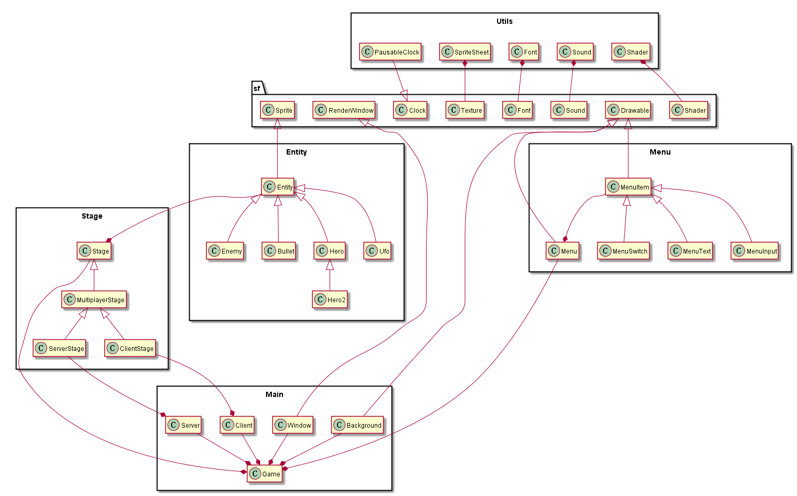
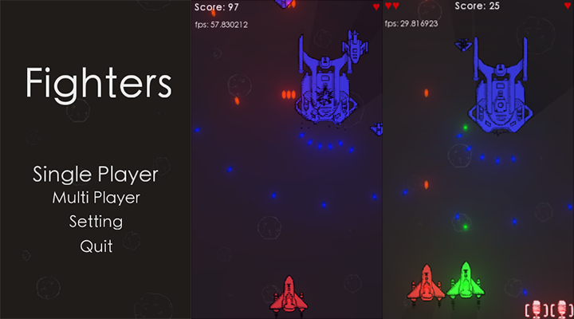

#Fighters

###给谁做的？
* 情侣，基友

###做什么？
* 功能：
    - 基本功能
    - 游戏菜单
    - 光影特效
    - 多人联机
* 规则：
    - 玩家有3条命
    - 按`Shift`开炮，按`z`使用炸弹
    - 方向键移动
    - 敌机从屏幕上方随机位置出来
    - 敌机从上往下运动
    - 速度小飞机最快，大飞机最慢
    - 有礼包
    - 没有关卡
    - 玩得越久，敌机出现频率越高，血量越大

###怎么做？
* 工具
    - Code::Blocks
* 库
    - SFML
* 配置开发环境
    - 在[SFML官网](http://www.sfml-dev.org/)下载对应版本的SFML并解压到合适的位置。
    - 打开Code::Blocks，打开菜单`Settings`-`Compiler...`，选择`GNU GCC Compiler`，点击`Copy`，输入名字"SFML Compiler"，确定。
    - 在`Search directories`下的`Compiler`添加SFML的include目录，在`Linker`添加SFML的lib目录。
    - 在`Linker settings`下添加`Link libraries`："sfml-main"，"sfml-system"，"sfml-window"，"sfml-graphics"，"sfml-audio"，"sfml-network"。
* 模块

|类名|描述|
|:---:|---|
|`Background`|一直滚动的背景图片|
|`PausableClock`|可暂停的Clock|
|`SpriteSheet`|解析pack文件并切割素材的工具|
|`Font`|全局共享的字体资源|
|`Sound`|全局共享的音乐控制工具|
|`Shader`|全局共享的Shader资源|
|`Entity`|有碰撞体积的Sprite|
|`Enemy`|敌机|
|`Bullet`|子弹|
|`Hero`|英雄|
|`Hero2`|第二个英雄|
|`Ufo`|礼包|
|`Stage`|单人游戏主体|
|`MultiplayerStage`|多人游戏主体|
|`ServerStage`|服务端游戏主体|
|`ClientStage`|客户端游戏主体|
|`MenuItem`|菜单项|
|`MenuSwitch`|可切换状态的菜单项|
|`MenuText`|仅显示文字的菜单项|
|`MenuInput`|可输入文字的菜单项|
|`Menu`|菜单|
|`Game`|控制整个游戏|
|`Window`|自适应的窗口|
|`Server`|控制服务端的网络连接|
|`Client`|控制客户端的网络连接|
* 关系

###做得如何？
* 运行时的界面截图

* 程序运行速度
    - 开启Shader：帧率基本维持在60帧以上
    - 关闭Shader：帧率总是在60帧以上
* 程序大小
    - 程序文件：417,280 字节
    - DLL文件：4,935,693 字节
    - 资源文件：57,705,665 字节
* 玩家体验、评价
    - 越神：柱\*是\*。所以写出来的游戏也是\
    - *一般的非常完美。